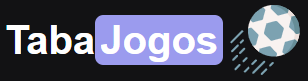
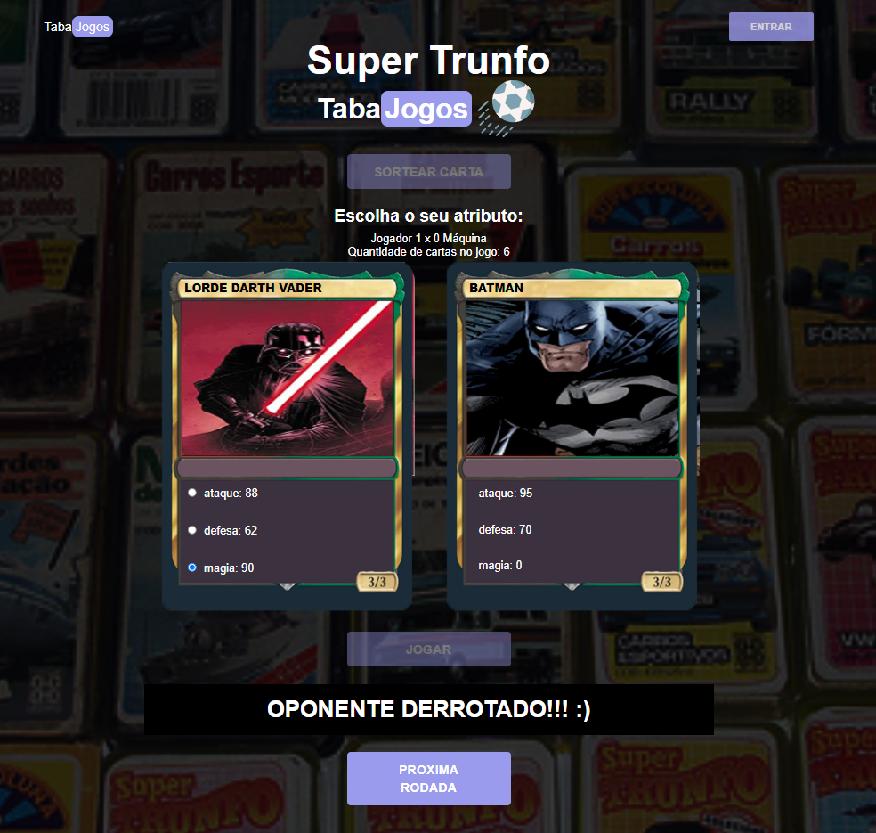

<h1 align="center">
  
</h1>

  <a href="#-tecnologias">Tecnologias</a>&nbsp;&nbsp;&nbsp;|&nbsp;&nbsp;&nbsp;
  <a href="#-projeto">Projeto</a>&nbsp;&nbsp;&nbsp;

 

  

## 🚀 Tecnologias

Projetos desenvolvidos para iniciação nas tecnologias:

- HTML
- CSS
- JavaScript

## 💻 Projeto

Jogue o tradicional "Supertrunfo" com heróis de diversos filmes e desenhos animados. Sorteie sua carta, escolha o atributo (ataque, defesa ou magia) de preferência do seu herói e inicie em "jogar". Caso a pontuação do atributo escolhido for maior que do seu oponente, você irá derrotá-lo e somar 1 ponto no placar, se for menor, a máquina irá somar 1 ponto, se for do mesmo valor, terá empate e ninguém soma pontos. Após o resultado da rodada, inicie novamente em "próxima rodada". Serão 4 rodadas para vencer o seu oponente no placar geral. Encerrando as rodadas, o jogo será iniciado com uma nova pontuação.

---

Feito através da [Imersão.dev_](https://imersao.dev/) organizada pela Alura e ministrada pelos instrutores Paulo, Rafaella, e Guilherme.